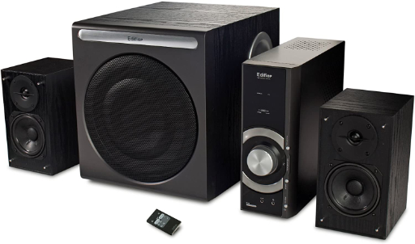
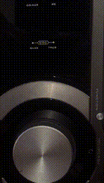
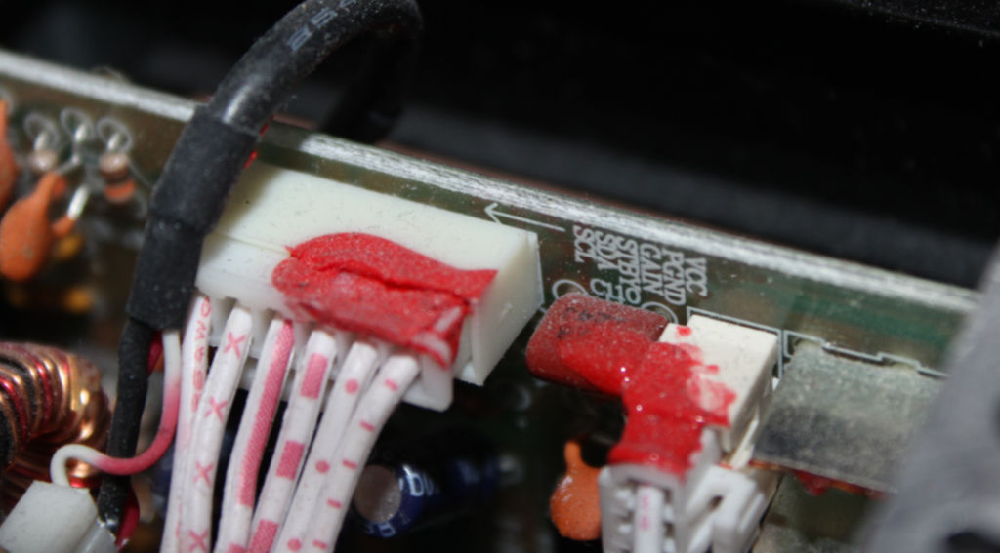
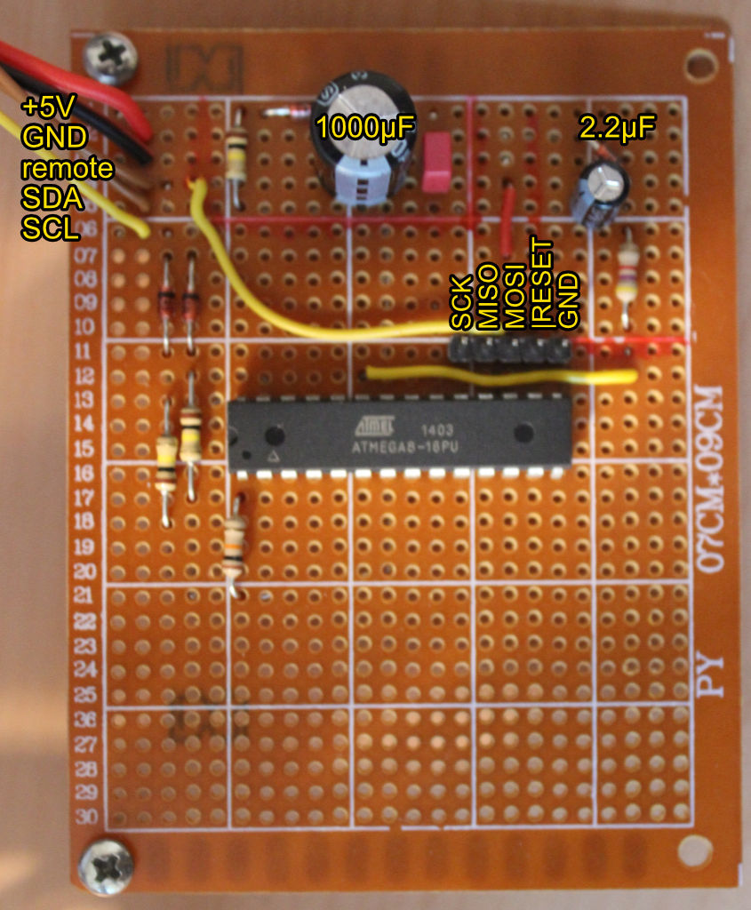
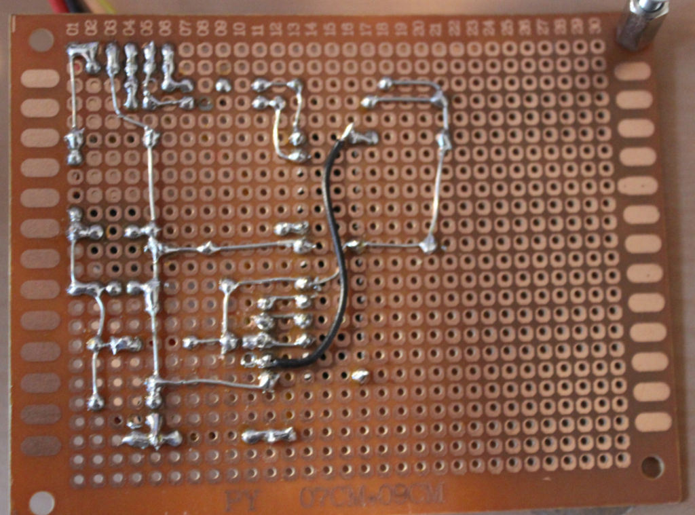
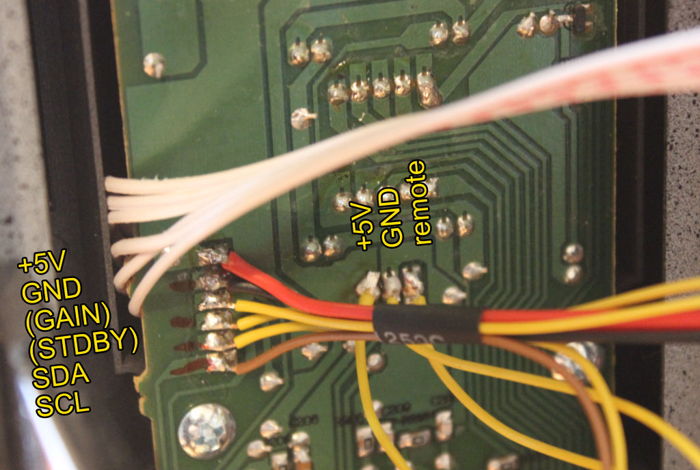
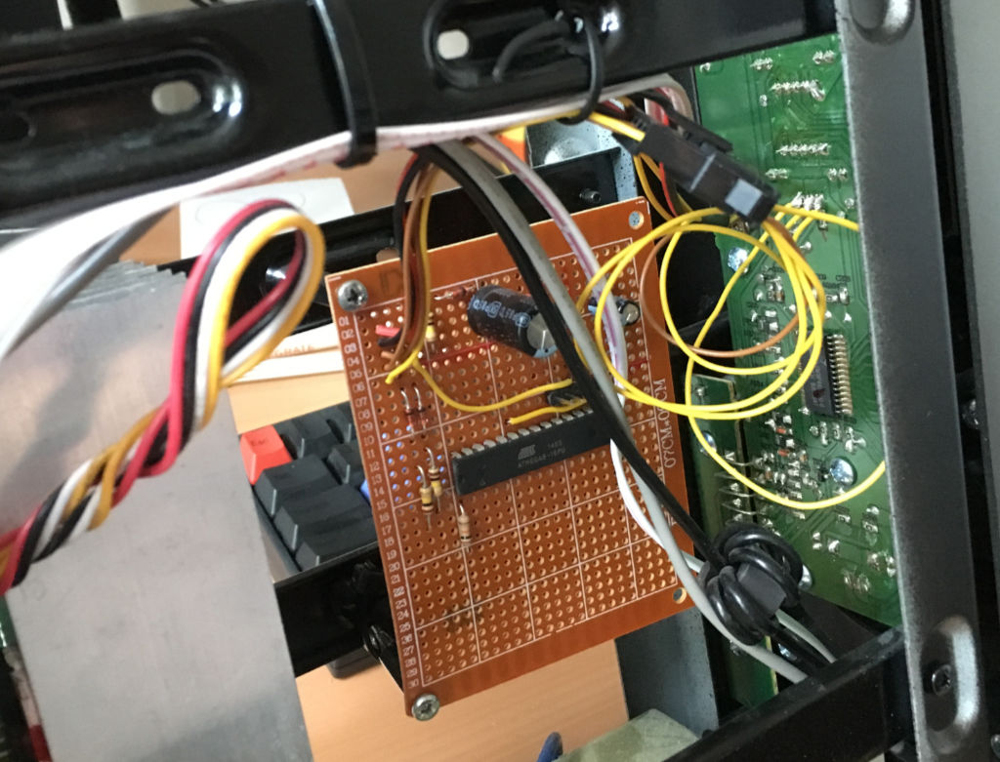

# EDIFIER-C3 Memory-Hack
Adding memory function to an edifier sound system, so it will restore volume settings after power loss.
I use an Atmega8 connected to an internal TWI to eavesrop current settings, store them on power loss and restore them using the remote controll interface.



# Introduction
Some time ago i boughed an Edifier C3 sound system for my desktop computer. It is a nice set of speaker and amplifier for it's price but it has no memory function and will lose all settings when disconnected from power. Everything on my desk is connected to single outlet strip and gets turned off when ever i am not using my pc. 

Per default the driver unit starts with a volume level of 30, which is to loud for my normal desktop usage and i needed to lower the volume to 15 everytime i switched on my outlet strip and start my computer. Windows kindly reminded me every single time, because of it's supirior starting sound. Also i needed to adjust my bass and treble settings. 

In short, this sound system wants power all the time.

I used an Atmega8 microcontroller and it's integrated eeprom to fix this problem.

# Building the Project

I missed to create a schematic for my Atmega8 board, but it is rather simple to build. I added some pictures of my findings for hooking up the Atmega8 to the controller board.

On Linux or macOS you can use the avr-gcc toolchain and the provided makefile.
Flashing the firmware on to the Atmega8 is done via an usbasp and avrdude

This script will get you started:
```bash
# build the project
make

# configure fuses on Atmega8
make fuse

# flash the firmware
make program
```

# Investigation

The amplifer unit is build out of two seperate boards.

* Driver board
* Front panel

The driver board is connected to the power outlet, speaker and audio input jacks.
The front panel has a small display, some buttons and a large rotary knob for controlling all settings. 
In Addition there is a remote controll for the amplifier.

I found a two wire interface (TWI) connecting the front panel and the driver board, so i hooked up a digital analyzer to see what it is carrying.
Everytime i changed the volume level, a package of 6 byte was transmitted with little changes in the containing bytes.



After some trial and error i was able to decode the messages send from the front panel to the driver. Every package contains the current settings encoded in some binary format.

There are 5 different settings:
* Volume (0 - 60)
* Input (AUX, PC)
* BASS (-9 - 9)
* TREBLE (-7 - 7)
* MUTED (ON, OFF)

# Implementation

I use the following components of an Atmega8

* Two-wire Serial Interface for eavesdrop current settings
* Serial USART for debug messages
* EEPROM to store current settings on power loss
* ADC for power loss detection
* Output Compare Match Output for simulating remote controll key press




## TWI
I use the Atmega8 integrated TWI for eavesdroping the current settings send from the controller board to the driver.
The used interface library is a copy of [https://rn-wissen.de/wiki/index.php/TWI_Slave_mit_avr-gcc]()

All packages get send with a slave address of '0x88'.
The TWI standard protocol defines, that a slave has to acknowledge an incoming package.
Also there can be no more than one device per slave address.

This behaviour can not be disabled for the Atmega8. So i added two diods on pin PC5 and PC4, so that it will not disturb the normal TWI communication.

## USART
I use a copy if Peter Fleury UART lib [http://www.peterfleury.epizy.com/doxygen/avr-gcc-libraries/group__pfleury__uart.html]() to display debug messages.

## EEPROM
The Atmega8 features an 512 bytes EEPROM with 100.000 write/erase cycles.
Because i want this unit to last for a long time, I only store the current settings during power loss.
Assuming i will turn off my sound system 3 times per day it should last more then 90 years.

Each EEPROM write (listed in the datasheet) takes 8.5 ms to finish, so the Atmega8 needs 42.5 ms to store all settings. 
I could also combine some setting value in less bytes but i wanted to keep it simple for now.

To prevent corruption of the EEPROM during low voltage writes, i anabled the integrated BOD (brown-out detection);
I added a capacitor for the Atmega8 power source so it will have enough time for storing all data. I also needed a diode, so the stored current of the capacitor will not flow back to other components of the amplifier.

## ADC
The ADC will be used to detect a power loss. I use the ADC0 at pin PC0 to compare the system voltage with systemvoltage behind a zener diode (which will drop the current). I also added a capacitor connected to pin PC0.

During normal operation the ADC will detect less power on the input then the reference.
On power loss the system voltage will drop, the voltage of PC0 will be higher then the system voltage and so the ADC register will reach it's maximal.

In short. The ADC will detect a power loss when it reaches it's max value.
I then disable the ADC and TWI interfaces to lower the power consumption of the Atmega8 and store all setting to EEPROM.

## Restore settings on power up
I am using the remote controll interface of the controller board for restoring settings on power up.
To simulate key presses when starting up the system, I connected pin PB3 to the photodiode of the controller board.

Using the IRSND Library [http://www.mikrocontroller.net/articles/IRSND\_-\_english]() I can induce signals, which normaly would be transmited by the remote controll.

## Remote Control Codes
The remote is sending NEC packages with the following command codes:

| Button | Address | !Address  | Command | !Command  |
|--------|------|------|------|------|
| Mute   | 0x00 | 0xFF | 0x41 | 0xBE |
| Vol+R  | 0x00 | 0xFF | 0x06 | 0xF9 |
| Vol+L  | 0x00 | 0xFF | 0x05 | 0xFA |
| Vol-R  | 0x00 | 0xFF | 0x49 | 0xB6 |
| Vol-L  | 0x00 | 0xFF | 0x47 | 0xB8 |
| IN-PC  | 0x00 | 0xFF | 0x03 | 0xFC |
| IN-AUX | 0x00 | 0xFF | 0x02 | 0xFD |
| Bass+  | 0x00 | 0xFF | 0x07 | 0xF8 |
| Bass-  | 0x00 | 0xFF | 0x5C | 0xA3 |
| Treb+  | 0x00 | 0xFF | 0x09 | 0xF6 |
| Treb-  | 0x00 | 0xFF | 0x1E | 0xE1 |

## Circuit Board Connection
The Atmega8 will be connected to the front panel using the connection points you can see in the picture below.




